#   Docker Introduction


1. docker pull hello-world
2. docker run hello-word
    -  docker run: docker pull then run it, if the image is not available in the local hub
    - if you do docker run again and again it will run in many different containers, so the thing is with one image we can run multiple containers, if it utilising some port, we can change the ports while running the imageW
    - 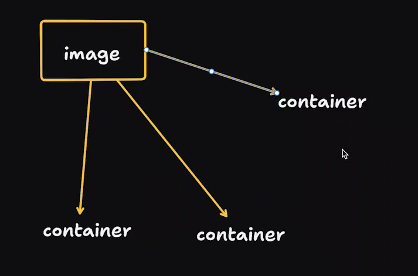


##  How to work with docker container

2.  docker ps -a
    -   list down all the container `[Container ID, Image, Command Status, Ports etc..]`
3.  docker start <container-id>
    -   start the running container keep in mind container not image
4.  docker stop <container-id>
    -   stop the running container keep in mind container not image
5.  docker rm <container-id>
    -   remove the stopped container again keep in mind container not image

##  How to work with docker images

1.  docker images
    -   shows all the images that are present in local hub `[Repo, Tag, Image ID, ..etc]`

2.  docker rmi <image-id>
    -   It will remove the image from the local hub
    -   Keep in mind it will only remove when the image is not utilized or running as container
    - If you try to delete an image, where you are already run a container related to the image, it will throw some error: `unable to delete ... image is being used by stopped/running container <container-id>`
    - so first stop the running container, delete the container and then only delete the image
    -   `Also you can delete it forcefully if you want to`


##  How to run container interactively: means that will not busy your terminal

1.  docker run tomcat
    -   If the image is going to run continuesly, the terminal will be busy to show you the output at real time.
    -   But in most of the cases you don't want to see the output you just want to start the container.
    -   So in technical term you want to run it as background process or it also know as `detached mode`.

2.  docker run -d tomcat

    -   -d is the flag used to run the container in detached mode.
    -   means whatever the task is run in background and keep my terminal free.


##  How to run commands inside the `running container`

1.  docker exec -it `<container-id>` /bin/bash

-   docker run alpine sleep 3600
-   docker exec -it `<container-id>` sh


##  Practice Time

1.  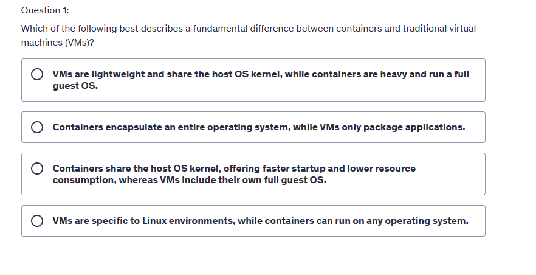
2.  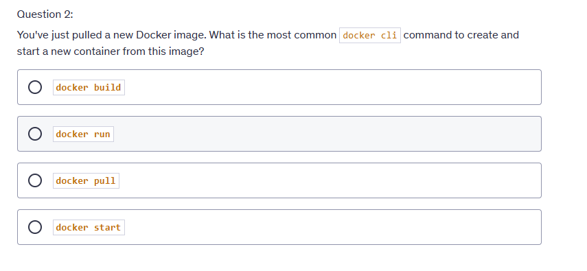
3.  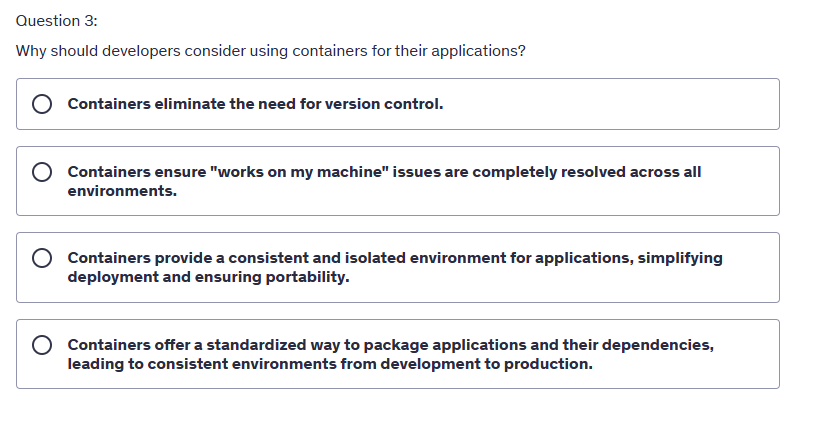

-   Answer 1: 3
-   Answer 2: 2
-   Answer 3: 4


##  Key concepts of Docker: `Images, Containers, Dockerfiles`

1.  Docker Images
    -   A Docker image is a lightweight, standalone, and executable package that includes everything needed to run a piece of software, including the code, runtime, libraries, environment variables and configurations.
    -   Layer
    -   Immutable: we can't change the image once it is created
    -   Portable: We can use this image in any operating system.

2.  Docker containers

    -   A container is a runtime instance of a Docker image. It is a lightweight, standalone and executable package that includes everything needed to run a piece of software/code.
    -   Isolation: Change a env run on different environment aka prod
    -   Ephermeral: Die then gone
    -   Portable

3.  Dockerfile


##  How to build an `React App` and create the DockerImage using the DockerFile

-   install nodejs from website
-   npm create vite
-   npm install
-   npm run dev
-   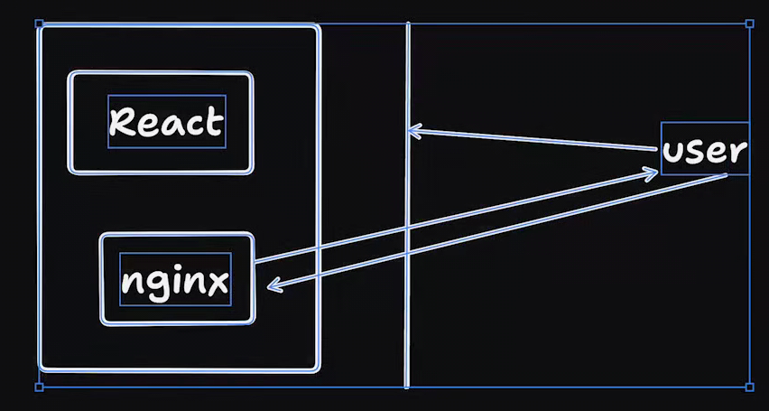
-   create a file named: `Dockerfile`

-   We will not copy node_modules folder

-   What is the difference between `run` and `cmd`
    -   run: Executes commands at build time [Image Level]
    -   cmd: Runs commands at container Runtime [Container Level] OR after O.S startup

```Dockerfile
FROM node:22-alpine

WORKDIR /app

# COPY package.json ./
# COPY package-lock.json ./

# COPY package*.json ./

COPY . .

RUN npm install

#COPY . .

EXPOSE 5173

CMD ["npm", "run", "dev"]
```

##  How to build as Docker image

-   docker build -t react-test .
    -   -t: providing tag to the image, nothing but just a reference name
    -   .:  what is the meaning of dot, it means from where i'll create this image, where the Dockerfile is, if it in current directory make it dot or pass the full path

##  How to run the docker image on a particular port

-   docker run -p 5173:5173 react-test
    -   -p:
    -   if you run it, it will not work, why? Just delete the image and move forward: docker rmi vite-test
-   change the vite.config.js if you are running the vite based react application
-   add the server data which host and port it allowed to run the image
```
export default defineConfig({
  server: {
    host: "0.0.0.0",
    port: 5173
  },
  plugins: [react()],
})

```
-   build the image again
-   docker run -p 5173:5173 vite-test
-   docker run -p 5173:5173 vite-test:2

##  What is the use of .dockerignore file?


##  Managing containers: Running, Stopping, Removing


### Running

-   docker run <image_id>/<image_name>
-   docker run -d  <image_id>/<image_name>
-   docker run --name my-container  <image_id>/<image_name>
-   docker run -p <HostMachinePORT>:<ContainerRunningPORT>  <image_id>/<image_name>
    -   docker run -p 8080:80  <image_id>/<image_name>
-   docker run -v $(pwd):/app  <image_id>/<image_name>
-   docker run -it <image_id>/<image_name> bash

-   docker ps
-   docker ps -a
-   docker logs <container_id>
-   docker attach <container_id>
-   docker stop <container_id>
-   docker kill <container_id>
-   docker stop $(docker ps -q)
-   docker restart <container_id>
-   docker start <container_id>
-   docker rm <container_id>
-   docker rm -f <container_id>
-   docker <container_id> prune
-   docker cp <container_id>:/path/to/file ./
-   docker cp SRC_PATH|- <container_id>:DEST_PATH


##  Containerizing a simple Node.js/Python app

-   Create a nodejs project or clone it from github then create the Dockerfile

```Dockerfile
FROM node:22-alpine

WORKDIR /app

COPY package*.json ./

RUN npm install

COPY . .

ENV PORT=3000

CMD ["node", "index.js"]
# CMD ["npm", "run", "start"]
```

-   docker build -t node-app .
-   docker run -p 4000:3000 node-app
-   docker run -p 4000:3000 -e PORT=3000 --rm node-app
-   docker run -p 4000:3000 --env-file .env --rm node-app


##  Docker multi-stage build

>   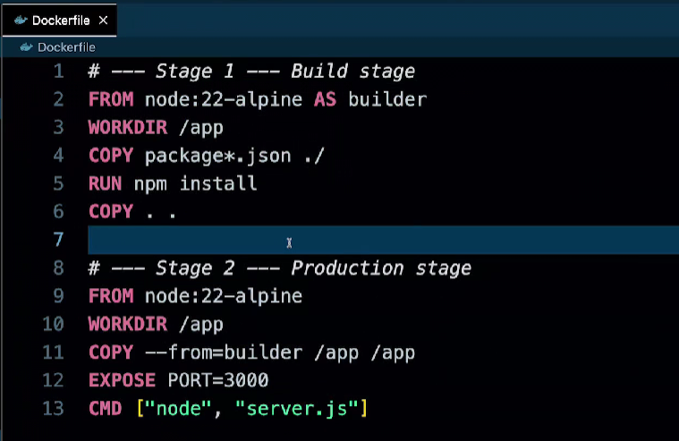 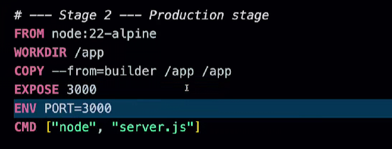


##  Quiz time

>   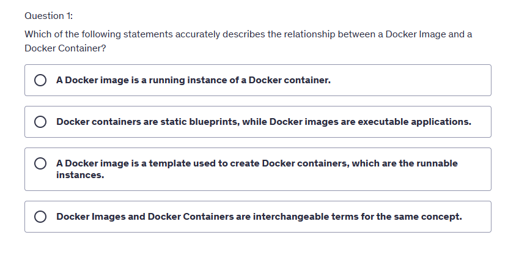 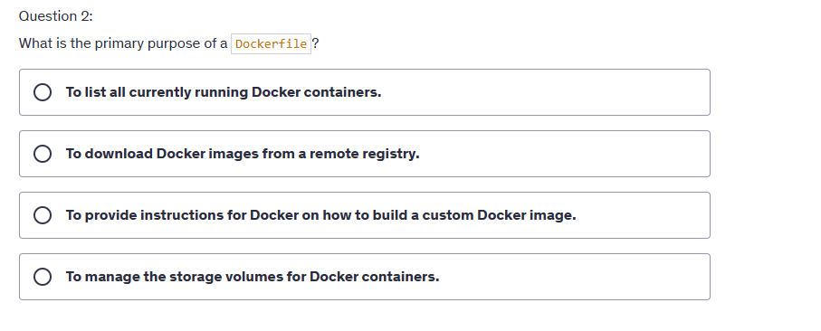 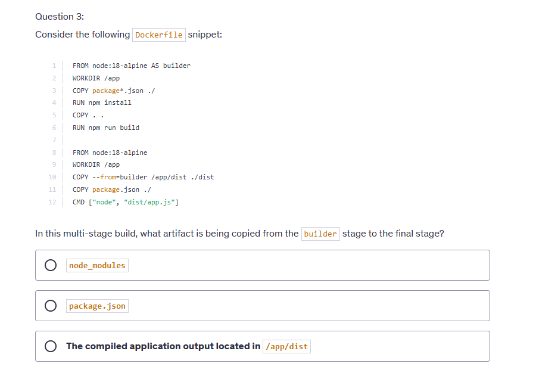


-   Answer 1: 3
-   Answer 2: 3
-   Answer 3: 3


##  Docker Networking

-   docker run --rm -it busybox sh
-   hostname
-   ping google.com
-   ifconfig
-   exit

-   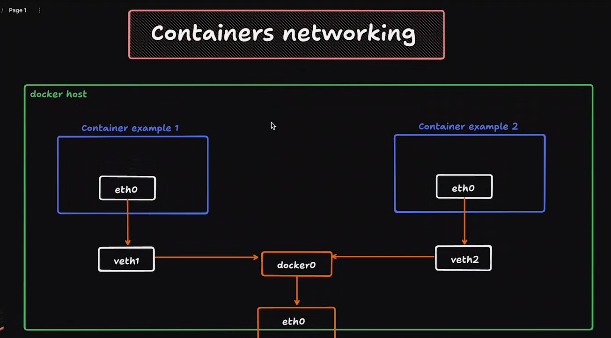
-   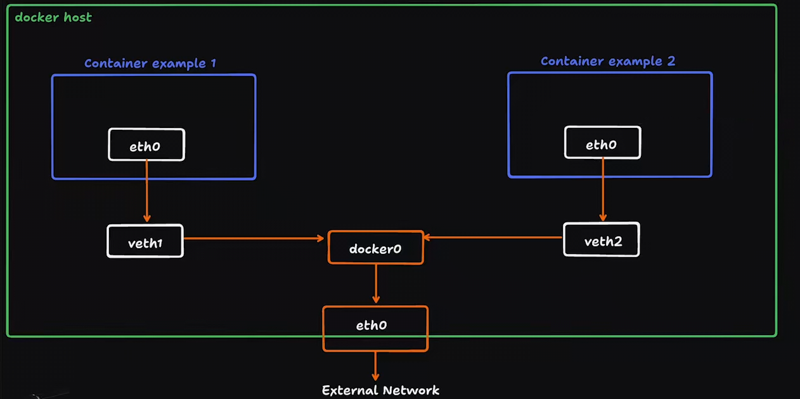
 
-   docker network
-   docker network ls

### Bridge, host and overlay networks

>   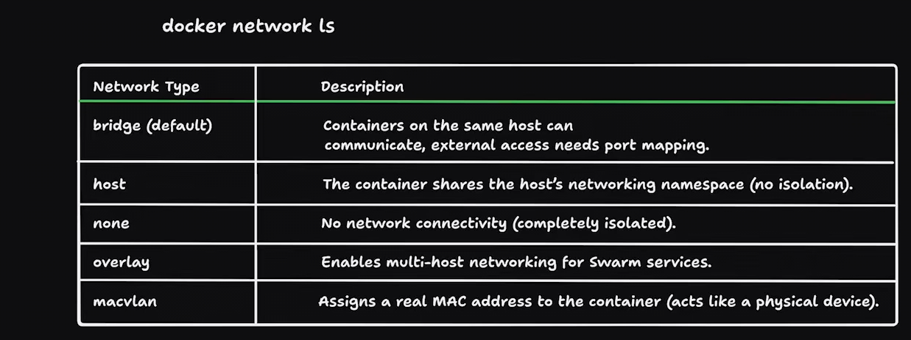

-   docker network ls
-   docker network inspect <network-name/bridge>
-   docker network create <network-name>
-   docker run --network my-network <container-id>
-   docker network connect my-network <container-id>
-   docker network disconnect my-network <container-id>
-   docker network rm my-network

####    Create a custom network and run container

-   docker network create my-bridge
-   docker network ls
-   docker run --network my-bridge --name container1 -d nginx
-   docker run --network my-bridge --name container1 -d alpine sleep 3600
-   docker exec -it container2 ping container1
-   docker run --network host -d nginx
-   docker run --network none -d alpine sleep 3600

```sh
docker network create -d macvlan \
--subnet=192.168.1.0/24 \
--gateway=192.168.1.1 \
-p parent=eth0 my-macvlan
```


##  Docker Compose

-   install docker compose if required
>   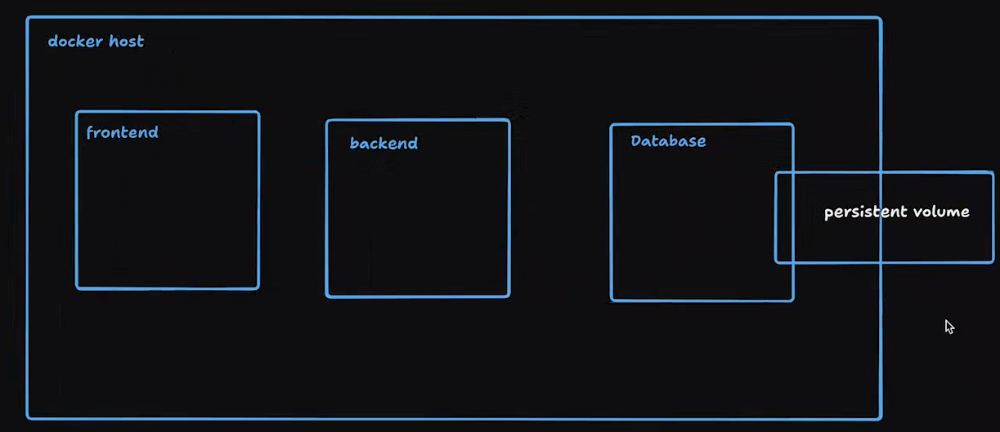

-   Create backend app
    -   npm init -y
    -   npm i express pg
-   create frontend app

-   create docker-compose.yml

-   docker-compose up