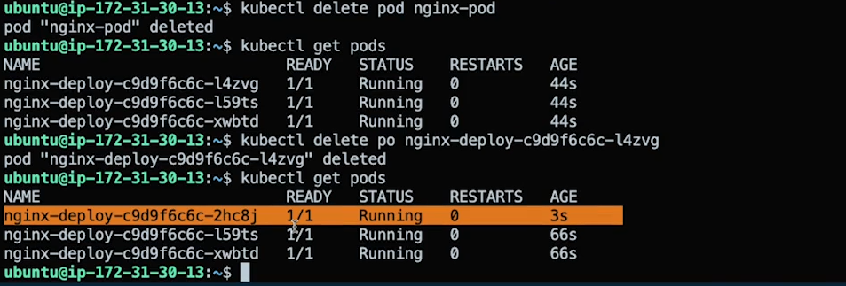
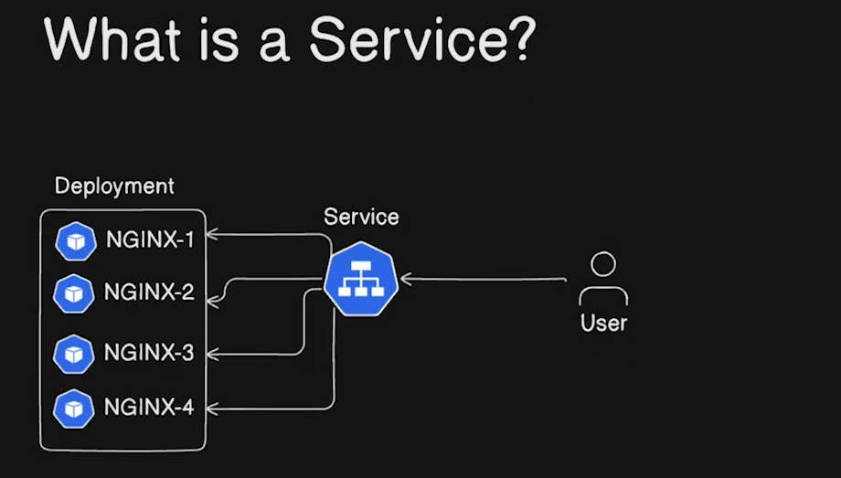

##  Kubernetes installation in linux

-   Starting up the ubuntu virtual machine on Vbox or EC2 instance
>   Install minikube
-   minikube --help
-   minikube start --nodes 3
-   minikube status

>   Install kubectl

-   setup it's path
-   verify: kubectl version --client
-   kubectl get nodes
-   kubectl get pods -A


##  Deploy a sample pod

### Imperative Way

-   kubectl run --image=nginx nginx-pod
-   kubectl get pods
-   kubectl --help
-   kubectl run --help
-   kubectl logs nginx-pod
-   kubectl logs -f nginx-pod
-   metadata: `kubectl describe pod nginx-pod` OR `kubectl describe pod/nginx-pod`

### Declerative Way

-   We need to create a yaml file for it

-   kubectl get pod nginx-pod
-   kubectl get pod nginx-pod -o yaml : took the relavent data from this `apiVersion, kind, metadata etc...`

-   create pod.yaml
```yaml
apiVersion: v1
kind: Pod
metadata:
  name: nginx-pod-2
  labels:
    env: test
spec:
  containers:
  - name: nginx
  - image: nginx:latest
```

-   kubectl create -f pod.yaml
-   kubectl get pods

>   Let's see if we do not want to write all of this where we can get this

-   kubectl run nginx-3 --image=nginx --dry-run=client -o yaml > pod3.yaml
-   cat pod3.yaml
-   kubectl create -f pod3.yaml
-   kubectl get pods

##  How to make changes in the running pods

-   kubectl edit pod nginx-3
-   change the label or something
-   kubectl get pods
-   kubectl get pods --show-labels

##  How to make changes in the running pods using existing yaml [Mostly used]

-   vi pod3.yaml
-   change the label or something
-   kubectl apply -f nginx-3/pod3.yaml

##  How to go inside running container

-   kubectl get pods
-   kubectl exec -it nginx-3 -- bash
-   additional details: kubectl get pods -o wide


##  What is deployment

>   

>   

>   

>   


##  Create a sample deployment: imperative

-   kubectl get pods

>   

-   kubectl delete pod nginx-3 nginx-pod-2

-   kubectl create deployment nginx-deploy --image=nginx --replicas=3

-   kubectl get pods

>   

-   If you delete the pod that is created using deployment it will create it again

>   

-   kubectl get deploy
-   kubectl describe deploy nginx-deploy

>   Deleting the deployment pod won't do anything, it will auto create again
-   Then how we can delete the pods, we have to delete the deployment or reduce the replica set

-   kubectl scale deployment nginx-deploy --replicas=2

-   kubectl get pods
-   kubectl get deployment
-   kubectl describe deployment nginx-deploy

>   Another way

-   kubectl edit deployment nginx-deploy

>   

-   change the replicas from 2 to 4

-   kubectl get pods
-   kubectl get deployment

##  Create a sample deployment: declerative

-   kubectl create deployment sample --image=nginx --dry-run=client -o yaml > deploy.yaml
-   cat deploy.yaml
>   
-   why it has apps/v1
    -   kubectl explain deployment 
    -   kubectl explain pods

##  How to do rollout

-   kubectl rollout --help
-   kubectl rollout restart deployment nginx-deploy
-   kubectl get pods
-   kubectl rollout history deployment

>   Undo the rollout

-   kubectl rollout un do deployment nginx-deploy

-   kubectl edit deployment nginx-deploy
-   change the replicas from 4 to 2
-   kubectl get pods
-   kubectl rollout status deploy nginx-deploy

>   

##  What is service

>   

>   There are three types of service
    -   clusterIP - internal access only, like from backend to db
    -   nodePort - external but on specific port
    -   loadbalancer - endpoint
    -   externalname - customer domain

>   
>   

### NodePort

>   
>   

### Load balanncer
>   

##  Deploy a sample cluster IP service

f